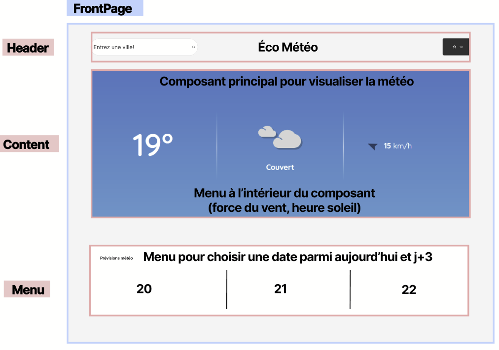
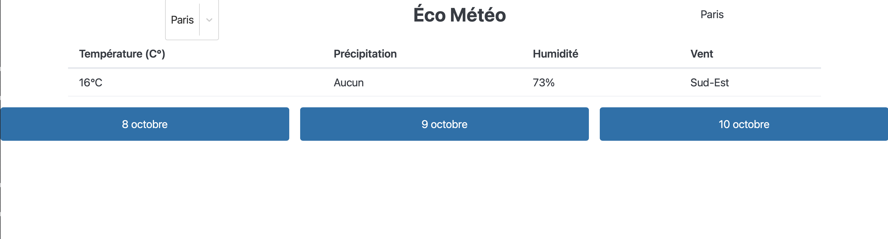
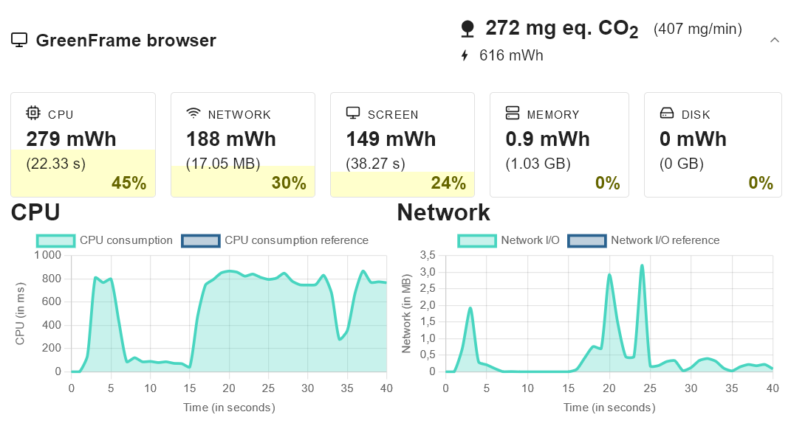
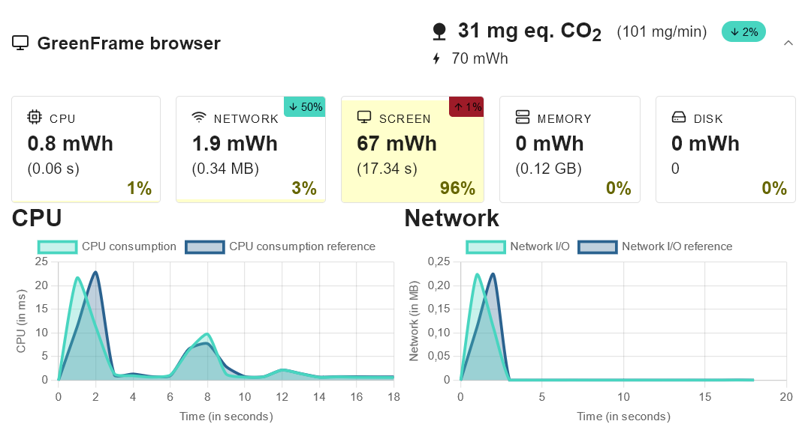
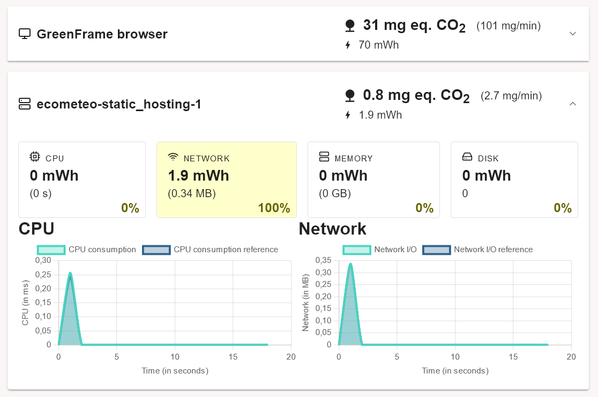
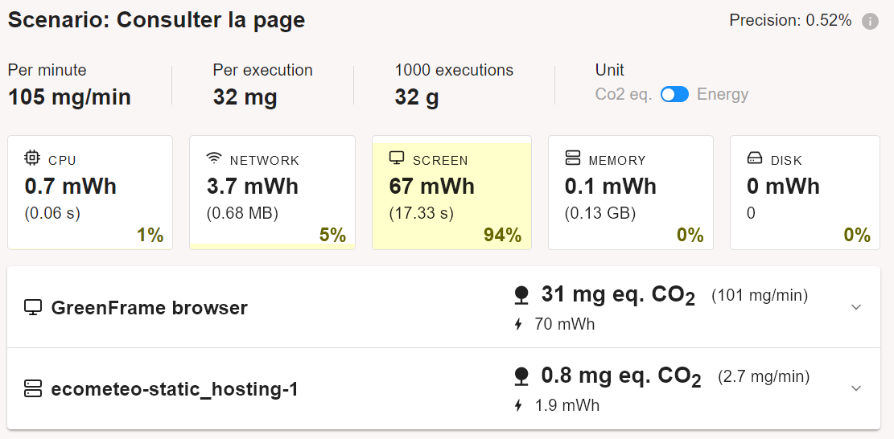
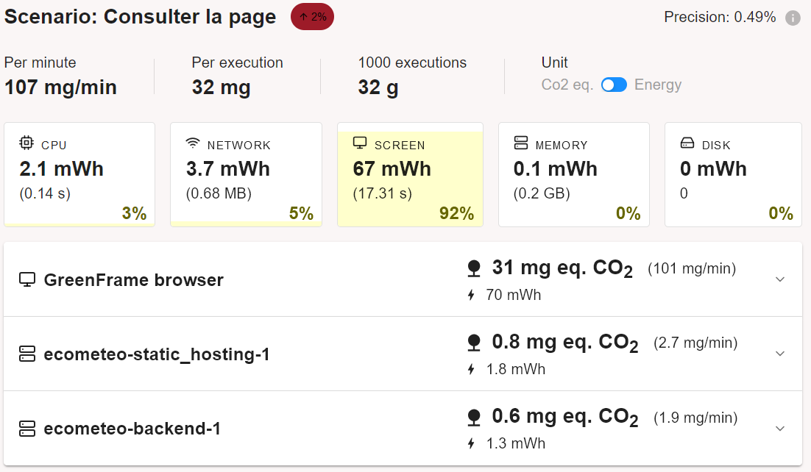
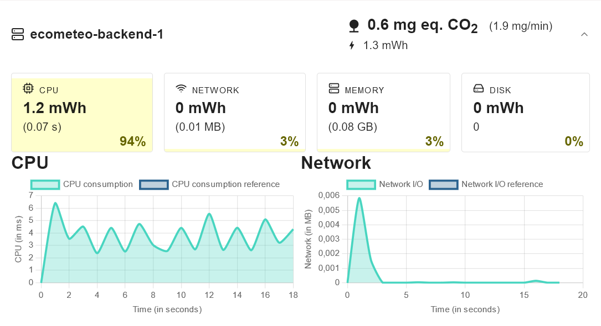
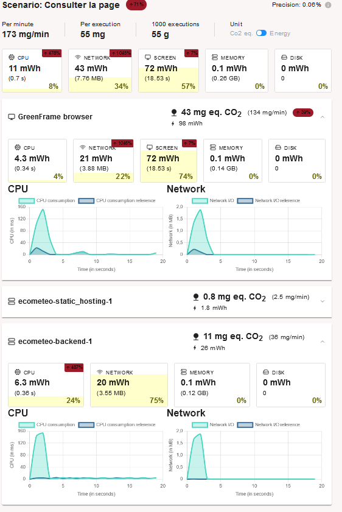
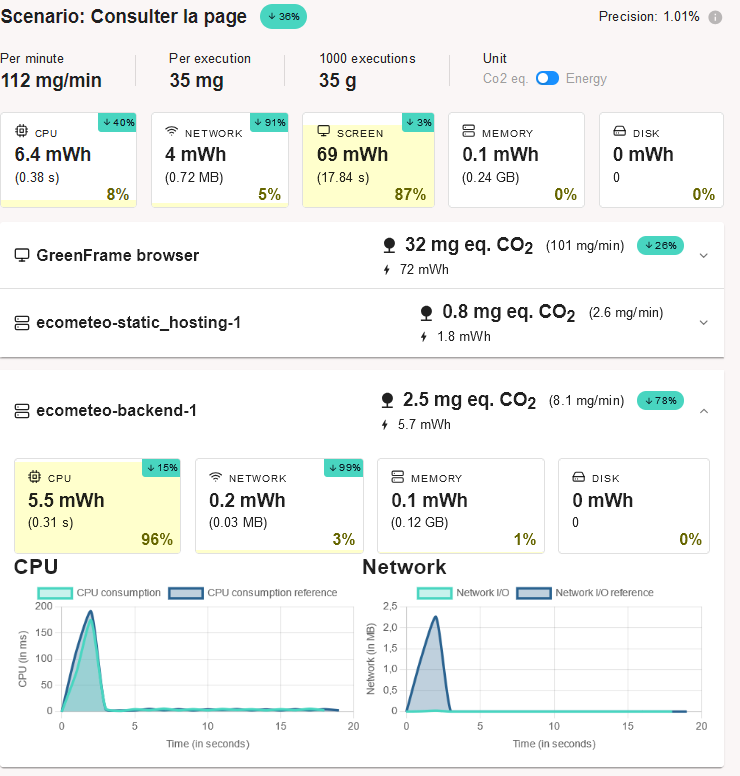

# ÉcoMétéo

# Description

### Choix du Sujet

xxx 

### Objectifs
L’application a pour objectif de fournir des prévisions météorologiques pour la France, tout en optimisant l'impact environnemental de l’accès à ces informations. Aujourd’hui, des services comme Météo France posent plusieurs défis environnementaux et d’expérience utilisateur, en particulier avec :
- La surutilisation des données météorologiques en ligne.
- Un rafraîchissement automatique très fréquent (parfois toutes les 30 secondes).
- Trop de publicités intrusives, dégradant l’expérience utilisateur.
- Une surcharge d’informations jugées peu essentielles (exemple : articles, météo de la France, météo sur 15 jours).

# Choix du sujet
Les sites et applications météo figurent parmi les plateformes numériques les plus consultées dans le monde. Ces services mobilisent d'importantes infrastructures, telles que des centres de données, pour offrir des prévisions en temps réel et des fonctionnalités avancées. Ce modèle, bien que pratique, contribue à une empreinte écologique non négligeable, notamment en raison de la consommation énergétique nécessaire pour la collecte, le traitement et la diffusion des données météorologiques.

Ainsi, il m'a semblé pertinent de concevoir une alternative plus respectueuse de l'environnement. Le projet vise à développer une application web météo allégée, optimisée pour limiter la surutilisation des données, réduire la fréquence de rafraîchissement, et éviter les publicités énergivores, tout en offrant une expérience utilisateur fluide et agréable.

# Utilité sociale
Un service de prévisions météorologiques joue un rôle central dans de nombreux aspects de la vie quotidienne et collective. Il constitue une ressource essentielle pour :

- La sécurité des individus : En alertant sur des phénomènes météorologiques extrêmes (tempêtes, canicules, inondations), il permet aux populations de se préparer et de réduire les risques pour leur vie et leurs biens.
- La planification des activités : Que ce soit pour les agriculteurs, les voyageurs, ou les organisateurs d'événements, les prévisions météo permettent d'adapter les décisions et de maximiser l'efficacité.
- La santé publique : Les alertes sur les épisodes de pollution ou de chaleur extrême sont indispensables pour prévenir des problèmes de santé, en particulier pour les populations vulnérables.
- La gestion des ressources : Dans des secteurs comme l’agriculture ou l’énergie renouvelable, la météo influence les décisions de production et d’utilisation des ressources, contribuant à une gestion plus durable.
- La vie sociale et culturelle : Les prévisions facilitent également l’organisation des loisirs et des déplacements, éléments cruciaux du bien-être et de la cohésion sociale.

# Impact de la numérisation
La numérisation a profondément transformé les comportements de consultation des prévisions météorologiques. Là où la météo était traditionnellement diffusée via la presse écrite, la télévision ou la radio, elle est désormais accessible instantanément, à tout moment et en tout lieu, grâce aux smartphones, ordinateurs et objets connectés. Cette évolution soulève plusieurs enjeux :

  - Substitution ou addition aux anciens moyens :
    - Si certains utilisateurs ont abandonné les supports traditionnels pour consulter la météo exclusivement en ligne, d’autres continuent d’utiliser ces supports tout en intégrant des consultations numériques. Ainsi, dans bien des cas, la numérisation s’ajoute aux pratiques existantes plutôt que de s’y substituer, augmentant globalement la consommation d’énergie liée à la météo.
    - Exemple: une personne peut regarder les prévisions à la télévision le matin, mais vérifier les mises à jour plusieurs fois dans la journée sur son smartphone.

  - Effet rebond :
    - La simplicité et la rapidité d’accès aux prévisions via les outils numériques encouragent une consultation fréquente et parfois excessive. Ce phénomène entraîne une surconsommation de données et d’énergie.
    - Exemple : Alors que la consultation de la météo via un journal ou une émission télévisée se faisait une ou deux fois par jour, les utilisateurs d’applications météo consultent désormais ces informations plusieurs fois par jour, voire par heure, même en l’absence de besoin réel.

  - Baisse ou hausse de l’impact écologique par rapport aux moyens traditionnels :
    - Si l’accès numérique peut sembler moins coûteux en ressources matérielles que la presse écrite (papier, encre, transport) ou la diffusion télé/radio (énergie des antennes et équipements), la réalité est plus     complexe. Les infrastructures numériques (centres de données, serveurs, réseaux) génèrent une empreinte énergétique importante, souvent invisible pour l’utilisateur.
    - Par ailleurs, le caractère instantané et personnalisable des prévisions numériques alimente un usage intensif, ce qui limite le potentiel bénéfice écologique par rapport aux anciens supports.

  - Notre solution face à ces défis :

    - Optimisation de la consommation énergétique : En réduisant la fréquence de rafraîchissement des données (par exemple, toutes les 5 minutes au lieu de 30 secondes), ou en permettant à l’utilisateur de choisir un rafraîchissement manuel, nous limitons l’impact environnemental.
    - Réduction des données affichées : En privilégiant une interface minimaliste et centrée sur les informations essentielles, nous réduisons le transfert de données inutiles. Les informations secondaires restent disponibles à la demande, mais leur affichage est restreint.
    - Prévisions à court terme : En nous concentrant sur des prévisions fiables à 3 jours maximum, nous limitons la surcharge des serveurs et la consommation énergétique liée à des calculs pour des périodes plus longues, souvent moins précises.
    - Effet incitatif à long terme : En réduisant la demande en données météorologiques massives, notre solution pourrait inspirer d'autres développeurs et fournisseurs d'API météo à adapter leurs pratiques, créant un effet positif à l’échelle de l’écosystème numérique. 

# Scénarios d'usage et impacts
Nous faisons l'hypothèse que les utilisateurs visitent notre plateforme plusieurs fois par jour, par exemple en milieu d'après-midi avant de sortir pour une activité en extérieur ou avant de partir au travail, afin de vérifier les conditions météorologiques actuelles et les prévisions à venir. Ces visites peuvent durer quelques instants seulement. Pour cette raison, nous avons choisi de modéliser les scénarios suivants : l'un centré sur la consultation rapide de la météo en temps réel, et l'autre sur l'exploration des prévisions à long terme pour planifier des événements futurs.

# Scénario 1 Consultation de la météo sur Paris et d'un article
  1. L'utilisateur se connecte à Météo France ou à un autre service météo en ligne.
  2. Il sélectionne sa localisation (ville, région) ou laisse le site utiliser sa position géographique.
  3. Il choisit de voir la météo du weekend.

# Scénario 2 Exploration des prévisions à long terme
  1. L'utilisateur effectue à nouveau les étapes 1, 2 et 3 du scénario 1.
  2. Il consulte les prévisions à court et moyen terme qui lui sont proposées en fonction de sa localisation.
  4. Les détails complets des prévisions pour cette période (températures, précipitations, vent, etc.) s'affichent.
  5. Il revient à la liste des prévisions pour continuer son exploration ou consulter d'autres jours.

# Impact de l'exécution des scénarios auprès de différents services concurrents
L'EcoIndex d'une page (de A à G) est calculé (sources : [EcoIndex](https://www.ecoindex.fr/), [GreenIT](https://github.com/cnumr/GreenIT-Analysis/tree/acc0334c712ba68939466c42af1514b5f448e19f)) en fonction du positionnement de cette page parmi les pages mondiales concernant :

  - le nombre de requêtes lancées,
  - le poids des téléchargements,
  - le nombre d'éléments du document.

Nous avons choisi de comparer l'impact des scénarios sur différents services de météo nationaux :

  - [analyse Météo France](./benchmark/greenit_analysis_extension/MeteoFrance_greenit.png),
  - [analyse La Chaîne Météo](./benchmark/greenit_analysis_extension/LaChaineMeteo_greenit.png),
  - [analyse MétéoCiel](./benchmark/greenit_analysis_extension/MeteoCiel_greenit.png),
  - [analyse Météo60](./benchmark/greenit_analysis_extension/Meteo60_greenit.png).

Ayant eu des problèmes avec l'utilisation de greenit et des scénarios, par soucis de clarté nous avons décidé d'utiliser uniquement l'extensions Google Chrome de greenit pour chacun des services météo.
L'analyse est porté sur la page principale de chacun des sites.

### ce qu'on retiens des analyses

# Maquette de l'interface et échantillon de données

Au vu des différents services comparés, des exigences environnementales exprimées plus haut et des scénarios retenus, nous avons défini pour notre prototype une maquette de l'interface et un échantillon de données réalistes.

L'interface retenue est composée d'une seule "page Web".
On y retrouve le header avec le nom du site et un formulaire permettant de choisir la ville. Une partie principale où l'on pourra observer les prévisions météo. Et enfin, un menu qui permet de choisir le jour que l'on souhaite observer. (cf. Fig. 1)

__Fig.1 :__ maquette de l'interface du prototype

Pour des raisons de respect des droits d'auteurs, nous utilisons des données générées (avec dummy-json). Bien que fictives, ces données correspondent à la structure des services concurrents.
Nous avons donc généré la météo sur 7 jours pour 3 villes diférentes.
Le format des données est inspiré de celle d'API que nous avons pu trouver, les villes remplacent les stations météo.

Ainsi, pour chaques jours, nous avons :

  - température, 
  - taux d'humidité, 
  - vent, 
  - précipitation.

# Prototype n°1 : Fonctionnalités pour le scénario prioritaire avec données statiques

Pour cette première version du prototype :

  - l'échantillon de données est encore chargé dans le code de manière statique,
  - les fonctionnalités implémentées ne sont que celles nécessaires pour suivre le scénario prioritaire ("Regarder la météo sur Paris").
Ce scénario nécessite de pouvoir charger la page principale et regarder la météo sur Paris.

## Page Météo

Nous avons développé la page météo (cf. Fig. 2) pour qu'elle affiche l'échantillon de données sous une forme proche de ce que prévoyait la maquette.

__Fig.2:__ Prototype de la page météo

Pour l'instant, nous avons choisi un *framework* de mise en page minimaliste ([*PicoCSS*](https://picocss.com)).
Nous verrons si l'impact environnemental du passage à un *framework* de mise en page plus puissant est significatif ou non.

Nous avons décidé pour l'instant de n'inclure aucune image ni design spécifique (pas de style sur la page) pour l'affichage de la météo. Même si ce style rend l'utilisation de la plupart des applications de prévisions météo agréablent, il est parfois inutile, apporte une polution visuelle et peu avoir un impact environnemental.
Dans les prochains prototypes, nous allons inclure des pictogrammes, de petits dessins souvent au format CSV qui sont très légers et rendent l'utilisation d'un site beaucoup plus agréable.
Également, les données statiques que nous utilisont ici sont uniquement les données importantes, nous n'avons pas encore vu la partie pour afficher des données supplémentaires.
En fonction de l'utilité de ces dernières et de leurs impact nous les ajouterons ou non aux prototypes suivants.

Dans l'état actuel du prototype, il est possible d'avoir une première idée de l'impact environnemental du *frontend*.
Bien entendu, il manque encore le chargement dynamique des données, mais nous pouvons déjà évaluer l'impact de l'affichage des données et du *framework* (au sens large : *React*, *PicoCSS*, *DayJS*).
Cette évaluation de l'impact (cf. Tab.1) est déjà encourageante en mode "développement" mais encore plus en mode "pré-production".
Nous mesurons ici l'effet positif de l'adoption d'outils de développement Web intégrant la ["minification"](https://fr.wikipedia.org/wiki/Minification) (cf. *Wikipédia*) du code et la concaténation du code d'une part et des feuilles de style d'autre part.

|   | EcoIndex| GES (gCO2e) | Taille du DOM | Requêtes | Taille de la page (ko)
|---|--------:|------------:|--------------:|---------:|---------------------:
| Mode "développement" | 82 A🟢 | 1,36 | 60 | 26 | 1678
| Mode "pré-production" | 94 A🟢 | 1,11 | 44 | 4 | 328

__Tab.1__: Évaluation de l'impact du prototype de la page d'accueil.

Avec l'ajout de cette page, on peut tester un scénario de consultation de la météo et mesurer son impact.

|   | EcoIndex| GES (gCO2e) | Taille du DOM | Requêtes | Taille de la page (ko)
|---|--------:|------------:|--------------:|---------:|---------------------:
| 1. Consulter la page d'accueil | 95 A🟢 | 1,11 | 43 | 3 | 327
| 2. Choisir une ville | 95 A🟢 | 1,11 | 43 | 3 | 327
| 3. Choisir un jour | 95 A🟢 | 1,11 | 43 | 3 | 327

__Tab.2__: Évaluation de l'impact du scénario "consulter la météo" dans le prototype n°1.

Bien que ces estimation soient basses dû aux données statiques utilisées, elles nous permettent tout de même de comparer avec celle des services concurrents vues précédemment.

# Prototype n°2 : Fonctionnalités pour le scénario prioritaire avec données statiques chargées de manière dynamique

Pour cette deuxième version du prototype, les données (toujours statiques) sont désormais chargées par le frontend à travers le réseau immédiatement après un premier affichage à vide. Ce comportement, plus réaliste, n'a pour effet qu'une requête supplémentaire par page affichée.

Concernant l'évaluation de l'impact environemental du scénario, par rapport au tableau précédent (cf. Tab.2), à l'exception du nombre de requêtes qui est incrémenté de 1, les résultats sont strictement identiques. D'ailleurs, à partir de cette version, et à moins de changements profonds, l'EcoIndex ne devrait plus évoluer de manière significative. Nous utiliserons désormais un autre logiciel, GreenFrame, qui évalue non pas l'impact "environné" de la consultation (incorporant une participation au cycle de vie du terminal) mais celui de la consultation proprement dite (cf. Tab.3) et de manière beaucoup plus fiable à partir des statistiques d'utilisation des ressources physiques (CPU, mémoire, réseau, disque).

|   | Impact de la consultation de la page (mg CO2e)
|-----------|-----:
| La Chaine Météo | 72 | 
| Météo60 | 88 |
| MétéoCiel | 48 | 
| MétéoFrance | 272 | 
| EcoMeteo | 32 |

Tab.3 : Impact de la consultation de la page principale des sites météos concurrents (y compris notre service).

Pour les services existants, sur le graphique présentant l'utilisation dans le temps des ressources (cf. Fig.4), on constate d'autres pics que le pic initial, probablement associés au chargement et à l'affichage de contenus multimédias et de publicités, ou causés par des techniques de pistage sur le Web. De plus, l'utilisation CPU est extrêmement forte.

Fig.4: Consommation de ressources lors de la consultation de la page MétéoFrance.

Pour notre prototype, au contraire, le graphique (cf. Fig.5) présente un unique pic significatif de consommation de CPU et de réseau. Notons par ailleurs que le pic de CPU est 40 fois plus faible que celui de la figure précédente. Par ailleurs, nous remarquons que cette consommation ne compte que pour 4% de la consommation totale, le reste étant consommé par l'écran durant la durée de la mesure.

Fig.5 : Consommation de ressources par le navigateur lors de la consultation de la page météo dans notre prototype.

Par ailleurs, il nous est possible désormais d'évaluer l'impact écologique de la partie "serveur", possiblement hébergée par un data center (cf. Fig.6). Réduite au simple hébergement de données statiques sur un serveur Web, cette partie a pour l'instant un impact très faible et quasi négligeable (3%) par rapport à la partie "client" .

Fig.6 : Consommation de ressources par le serveur Web lors de la consultation de la page météo dans notre prototype.

# Prototype n°3 : Fonctionnalités pour le scénario prioritaire avec données stockées dans une base de données

Pour la troisième version du prototype, les données sont désormais stockées dans un système de base de données interrogeable à travers une API Web (CouchDB). L'intérêt d'une source de données dynamique est d'une part, à terme, de pouvoir ajouter ou modifier des données plus facilement, et d'autre part de déporter sur le serveur le filtrage des données pertinentes.

Concernant ce deuxième enjeu, contrairement au projet du professeur, notre prototype se limite à une seule page. Ainsi, les mesures (cf. Fig.7) ne montrent pas de diminution de la charge réseau entre les deux prototypes pour la consultation de la page d'accueil.

Fig.7 : Comparaison de l'impact de la consultation de la page d'accueil entre les prototypes 2 (en haut) et 3 (en bas).

En revanche, nous avons maintenant une utilisation continue du CPU par la base de données (cf. Fig.8).

Fig.8 : Profil dans le temps de l'impact de la base de données lors de la consultation de la page d'accueil.

De ces différentes mesures, nous pouvons retenir que l'effet de l'introduction d'une base de données, quoique négligeable, est, pour l'instant, plutôt défavorable d'un point de vue écologique. Le bilan de ce changement devrait cependant rapidement s'inverser avec l'augmentation de la quantité de données gérées.

# Prototype n°4 : Fonctionnalités pour le scénario prioritaire avec filtrage des données

### Passage à l'échelle

Dans notre cas, l'augmentation de la quantité de données à traiter proviendra essentiellement du nombre de villes prises en compte ainsi que du nombre de dates. Pour simuler un volume important de données lié à une augmentation du nombre de villes, nous avons conservé les trois villes initialement sélectionnées (Toulouse, Paris, Troyes). Cependant, nous avons ajouté un grand nombre de nouvelles dates. Cela reproduit l'effet de nombreuses villes avec quelques dates, tout en utilisant un nombre restreint de villes avec une multitude de dates. Cette approche nous permettra d'analyser les différences de performance de manière efficace.

### Évolution de l'impact environnemental avant correction

La figure 9 illustre l'impact du passage à l'échelle, de 15 à 9 000 fiches météorologiques (une fiche correspondant à une ville et une date). On observe, sur le backend, une multiplication par 5,8 de l'impact lié au processeur et, surtout, une augmentation significative de l'impact réseau : une multiplication par 11 pour le frontend, ainsi qu'une explosion non quantifiable (de 0 à 20 mWh) pour le backend.

Fig.9 : Évolution de l'impact de la consultation de la page d'accueil en passant de 15 documents à 9000.

### Prise en compte du passage à l'échelle

Dans notre contexte, pour contrer les défis liés à la mise à grande échelle, nous adopterons une stratégie visant à limiter les données récupérées à celles strictement nécessaires au moment de la consultation.  

En effet, récupérer toutes les données dès le début, comme cela pourrait être fait dans une application classique, entraînerait une surcharge inutile du système et un impact environnemental accru. À la place, nous mettrons en place un mécanisme de requêtes ciblées, où les fiches météo seront récupérées en fonction de paramètres spécifiques : **la ville** et **la date**.  

Ainsi, au lieu de charger l'ensemble des données disponibles, nous demanderons uniquement les informations nécessaires pour la fiche météo en cours de consultation. Ce fonctionnement nous permettra :  

1. De réduire le volume de données transférées et traitées, optimisant ainsi les performances du système.  
2. D'offrir une expérience utilisateur cohérente, sans ralentissement lié à la surcharge des ressources.  
3. De minimiser l'impact environnemental en adaptant la consommation d'énergie aux besoins réels de l'utilisateur.

Vous pourrez constater les améliorations réalisées grâce à cette optimisation.

Fig.10 : Évolution de l'impact de la consultation de la page d'accueil en ne récupérant que les fiches météo nécessaires.
